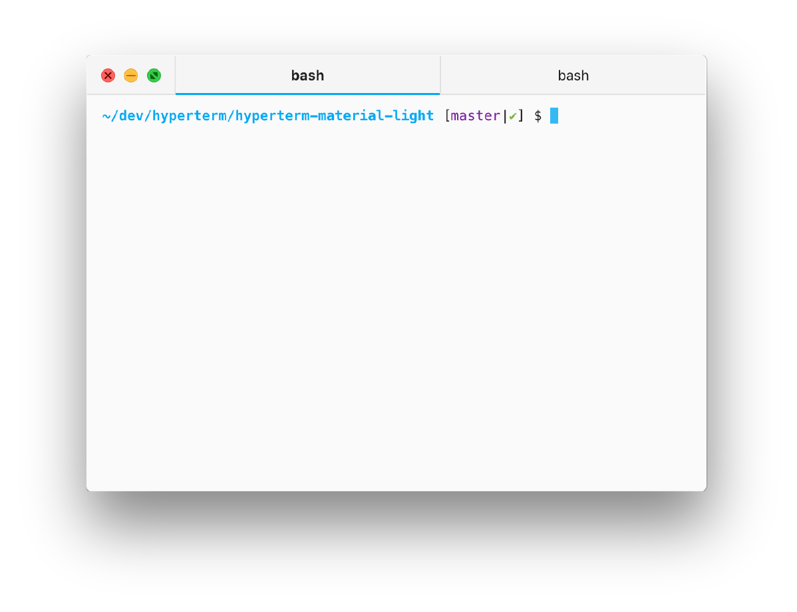

# Hyperterm Material Light

A material design based light theme for [Hyperterm](https://hyperterm.org/).



## Usage

Simply add this plugin to your array of plugins in `~/.hyperterm.js`:

```javascript
plugins: [`hyperterm-material-light`]
```

Save the file and you should see the theme be applied.

## Dark Theme

Prefer a dark theme? Check out [Hyperterm Material Dark](https://www.npmjs.com/package/hyperterm-material-dark)!

## License

This plugin is released under the [MIT License](./LICENSE).